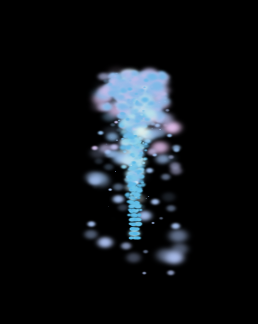
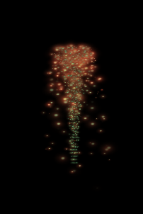

# cc-2.1.1-particles-color-issue

This project is to demonstrate Cocos Creator 2.1.1 particles color issue.

Particle was created in [Particle Designer](https://www.71squared.com/particledesigner)

## 2.1.0
One was created at Cocos Creator **2.1.0** and looks like

## 2.1.1
When you open it in Cocos Creator 2.1.1 it transforms to this. Color of particles is different from what it should be. Size of each particle is smaller then it was. No propertieis of ParticleSystem was changed.

